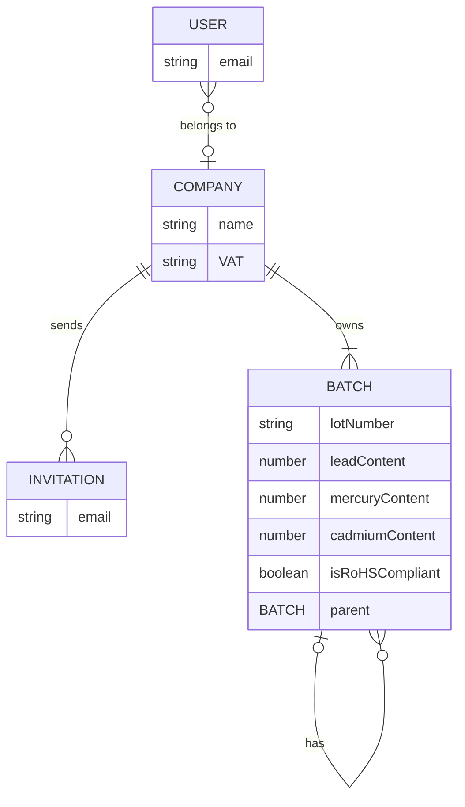

# ReceiverProduct

## env variables

We use dotenv vault to sync our dotenv keys - read more here: https://www.dotenv.org/docs/quickstart

Run `npx dotenv-vault@latest pull` to get the latest values.
You may need to login first.

## Start the application

Run `npx nx serve backend` to start the development server.
Run `npm run start:frontend` to start the frontend.

# Generating migrations

First run `npm run typeorm:build-config` to create a datasource file. You may need to export a `DATABASE_URL` variable.
Then run `typeorm migration:generate <migration-name> -d dist/typeorm.config.js`. If this fails, you may first need to run `typeorm migration:create apps/backend/src/migrations/<migration-name>`. Move the migration file to `apps/backend/src/migrations`.
Then import the generated migration into `app.module.ts`.

# Adding users

When a user signs up with auth0, their email is automatically added to the database via a Post User Registration Flow.
Locally users emails need to be added to the database manually. Ideally we would create them by sending a request from the frontend when signing up locally, but for now it is not necessary.

# Gneerate angular component
`nx g @nx/angular:component --name=<name> --directory=apps/frontend/src/app/<dir> --changeDetection=OnPush --inlineStyle=true --inlineTemplate=true --nameAndDirectoryFormat=as-provided --style=scss`

# Database Model

# Routes
/ (redirect to batches)
├── profile
├── create-batch
└── batches 